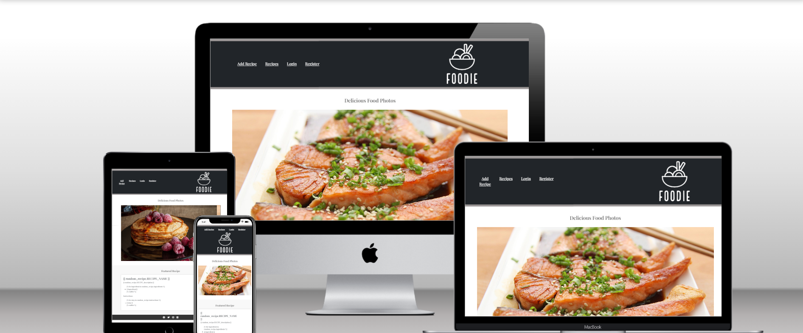
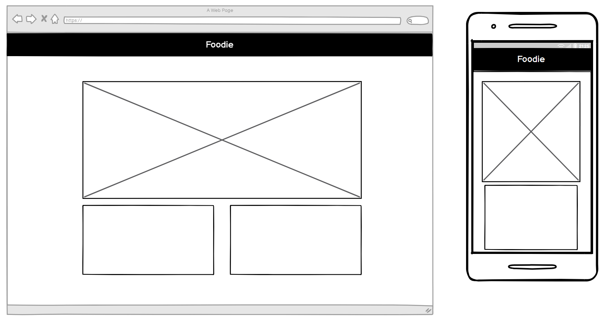
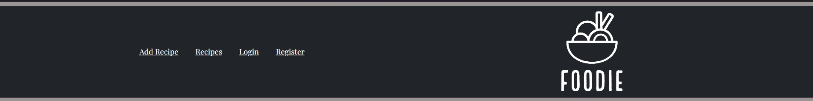
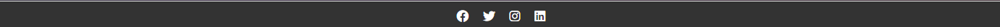
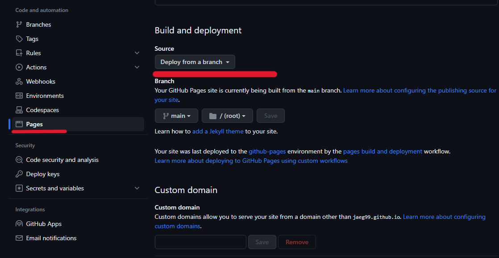
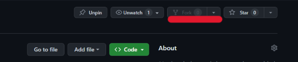
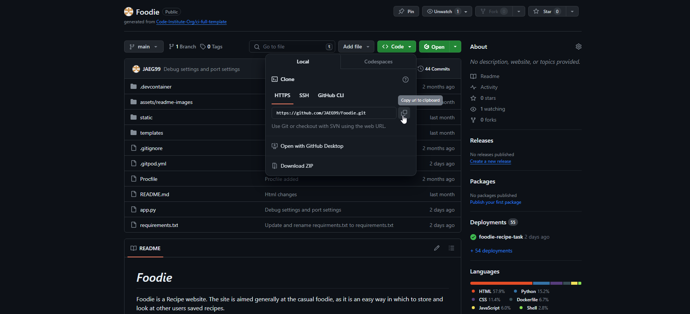

# **_Foodie_**

Foodie is a Recipe website. The site is aimed generally at the casual foodie, as it is an easy way in which to store and look at other users saved recipes.

Welcome to the journey through [Foodie](https://jaeg99.github.io/Foodie/index.html).

# Contents

* [**User Experience (UX)**](#user-experience-ux)
    * [User Stories](#user-stories)
    * [Wireframes](#wireframes)
    * [Site Structure](#site-structure)
    * [Design Choices](#design-choices)
    * [Typography](#typography)
    * [Colour Scheme](#colour-scheme)
* [**Features**](#features)
    * [**Home**](#Logo)
         * [Logo](#Logo)
         * [Start Button](#Start-Button)
         * [Game](#Game)
         * [Footer](#footer)
    * [**Future Features**](#future-features)
* [**Technologies Used**](#technologies-used)
* [**Testing**](#testing)
* [**Deployment**](#deployment)
* [**Credits**](#credits)
    * [**Content**](#content)
    * [**Media**](#media)
* [**Acknowledgements**](#acknowledgements)

# User Experience (UX)

## User Stories

* As a user, I want to be able to navigate through the whole site smoothly.
* As a user, I want to understand the purpose of the site upon loading it.
* As a user, I want to easily be able to contact Foodie for more information.
* As a user, I want to see mine and others recipes.
* As a user, I want to be able add my own recipes.
* As a user, I want to have an account.

[Back to top](#contents)

## Wireframes

The wireframes for Foodie were produced in [Balsamiq](https://balsamiq.com). My wireframes include full-width displays and also small and mobile displays. The final site does start slightly from the wireframes due to differences within the development of the site and my own abilities.

[Back to top](#contents)

## Site Structure

Foodie website has seven pages. The [home page](index.html) is the default loading page, the login page, the recipe form, the recipe page, recipes and the register page
[Back to top](#contents)

## Design Choices

 * ### Typography
      The font chosen was 'Playfair Display'. This was choosen to give the site a more classic and sleek look that match the classic style of a kitchen. 
      

 * ### Colour Scheme
      The color scheme was something I took a lot of time to choose. I wanted the webiste to match the classic black and white you see in more elegant kitches in resturants. This is seen throughout the site

[Back to top](#contents)

# Features

Foodie site is set up to be welcoming and easy to use. The landing page is a very simple page with the logo at the top in the header acting as a link back to the index. The bottom has a footer which is a consistent theme throughout the pages with social buttons and an email for socials of the website.

## Existing Features  
  * ### Logo

    * Since the page is a very simple one with little navigation needed, the only present part is the clickable logo taking you back to the home page.

[Back to top](#contents)

  * ### Add Recipe

      * Located To the left is the Add Recipe button which will take you to the page to add your own recipe

 * ### Recipes

    * This allows you to look at all the recipes that have been added to the database and be able to sort.

  * ### Login / Register
    
    * This lets the user log in or make a login to be able to add a recipe. This will use an Email which will be linked in the Database to use as a key.

[Back to top](#contents)

* ### Footer
    
    * The Footer is present at the bottom of both of the pages. It contains an email at which you are able to contact the site owner for any queries. 
    * The footer also shows four social FontAwesome logos all of which lead to their respective sites for people to share scores.

## Future Features 

* I would like to add a way to sort the recipes into savoury and into desert for people to have even more ways to find what they want.

* I would like to add a share button on recipies tied to peoples social media. This way they can share the wesbite but also share recipes

* I would like to add a way to be able to link social media accounts and use the emails from them also as a login.

[Back to top](#contents)

# Technologies Used
* [HTML5](https://html.spec.whatwg.org/) - provides the content and structure for the website.
* [CSS](https://www.w3.org/Style/CSS/Overview.en.html) - provides the styling.
* [Bootstrap](https://getbootstrap.com/) -  provided the scaling and box format.
* [Balsamiq](https://balsamiq.com/wireframes/) - used to create the wireframes.
* [Github](https://github.com/) - used to host and edit the website.
* [Visual Studio Code](https://code.visualstudio.com/) - was used when coding.
* [MongoDB](https://www.mongodb.com/) - Database
* [Heroku](https://id.heroku.com/login) - deployment

[Back to top](#contents)

# Testing

Please refer to [**_here_**](TESTING.md) for more information on testing Foodie.

[Back to top](#contents)

# Deployment

### **To deploy the project**
The site was deployed to GitHub pages. The steps to deploy a site are as follows:
  1. In the GitHub repository, navigate to the **Settings** tab.
  2. Once in Settings, navigate to the **Pages** tab on the left-hand side.
  3. Under **Source**, select the branch to **master**, then click **save**.
  4. Once the master branch has been selected, the page will be automatically refreshed with a detailed ribbon display to indicate the successful deployment.

### **To fork the repository on GitHub**
A copy of the GitHub Repository can be made by forking the GitHub account. This copy can be viewed and changes can be made to the copy without affecting the original repository. Take the following steps to fork the repository;
1. Log in to **GitHub** and locate the [repository](https://github.com/JAEG99/Foodie).
2. On the right-hand side of the page inline with the repository name is a button called **'Fork'**, click on the button to create a copy of the original repository in your GitHub Account.

### **To create a local clone of this project**
The method for cloning a project from GitHub is below:

1. Under the repository’s name, click on the **code** tab.
2. In the **Clone with HTTPS** section, click on the clipboard icon to copy the given URL.

3. In your IDE of choice, open **Git Bash**.
4. Change the current working directory to the location where you want the cloned directory to be made.
5. Type **git clone**, and then paste the URL copied from GitHub.
6. Press **enter**, and the local clone will be created.

[Back to top](#contents)

# Credits
### Content

* The font came from [Google Fonts](https://fonts.google.com/).
* The layout is from [Bootstrap](https://getbootstrap.com/).
* The icons came from [Font Awesome](https://fontawesome.com/).
* [Balsamiq](https://balsamiq.com/wireframes/) was used to create the wireframes.
* The logo was made with [Adobe](https://www.adobe.com/express/create/logo).
* HTML, CSS, and JavaScript help came from [W3Schools](https://www.w3schools.com/).
*The sound was from [Youtube](https://www.youtube.com/watch?v=w3MevX_jRQw&ab_channel=SoundEffects)

[Back to top](#contents)

# Acknowledgments
The site was made a part of Project 3 for [Code Institute](https://codeinstitute.net/). I would like to thank my mentor [Precious Ijege], my tutor [Komal Karir], and I would like to thank the rest of my peers for helping me fix problems and for helping me with ideas and discussions.

James Gilliland 2023.

[Back to top](#contents)
