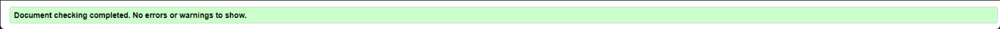
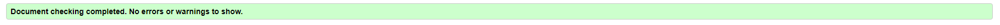

# Testing
## Code Validation
The Typer site has be throughly tested. All the code has been run through the [W3C html Validator](https://validator.w3.org/) and the [W3C CSS Validator](https://jigsaw.w3.org/css-validator/). There was a Button error on the indexc which I ammended, the CSS had two erros which were a very easy fix.

The HTML validator results for each page are below:

* Home page

* Projects page

* Inspiration page

* Contact page

* Form valiadtion page

The CSS validator results are below:

## Responsiveness Test

* The responsive design tests were carried out manually with [Google Chrome DevTools](https://developer.chrome.com/docs/devtools/) and [Responsive Design Checker](https://www.responsivedesignchecker.com/).

|        | Iphone SE | Galaxy S20 Ultra | iPhone 12 pro | iPad | iPad Pro | Display <1200px | Display >1200px |
|--------|---------|-----------|----------|------|----------|-----------------|-----------------|
| Render | pass    | pass      | pass     | pass | pass     | pass            | pass            |
| Images | pass    | pass      | pass     | pass | pass     | pass            | pass            |
| Links  | pass    | pass      | pass     | pass | pass     | pass            | pass            |

## Browser Compatibility

The Foodie website underwent testing on various browsers, namely Google Chrome, Microsoft Edge, Safari, and Mozilla Firefox, and no discernible issues were observed from the user's perspective. The website's appearance, functionality, and responsiveness remained consistent across a diverse range of device sizes and browsers.

## Testing User Stories

* As a user I want to be able to navigate through the whole site smoothly.
    * On the home page you can see the lareg start button which will take you to the games page. The logo also has a hover box to show you can click it and naviagte back to the landing page.

     
* As a user I want to understand the purpose of the site upon loading it.
    * The landing page has flair text that easy shows what the site is about and what you can do on it and what it is for.

     
* As a user, I want to easily be able to contact Foodie for more information.
    * On the footer you can see our email to be able to reach out to us. There is also the social links to the soical pages and my Github.

     
* As a user, I want to see mine and others recipes.
    * USing the Recipes tab you are able to all other Recipes that are within the Database of the site and be able to sort them.

     
* As a user, I want to be able add my own recipes.
    * YOu can use the Recipes form to be able to add your own with all the information you need and want to be able to use and share them
    
     
* As a user, I want to have an account.
    * You are able to use the register and sign in to make an account that will be linked with the recepies you add.

## Known Bugs

    * On mobile devices you can sue the autocorrect to skip some of the spelling but the JS will not detect it and put you behind where you are.

    * The rest button can be used to keep in getting paragraphs

    * Flask while installed will not allow the site to deploy. Using all recources available I and many others are unsure as to why this is the case.

Back to [README.md](./README.md#testing).